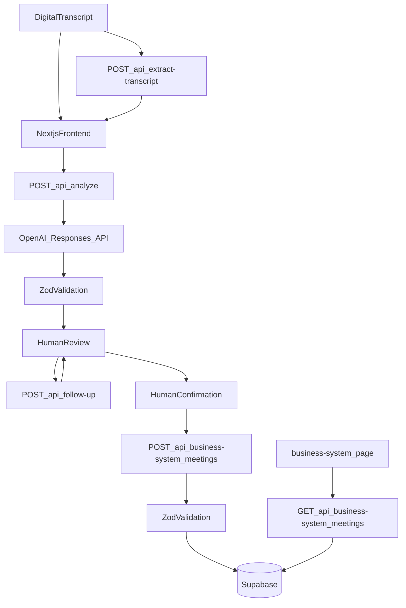

# MeetingFlow AI

## Product Requirements Document / Statement of Work

| Field | Value |
| --- | --- |
| Product | MeetingFlow AI |
| Document type | Combined PRD and SoW |
| Status | Approved after design interview |
| Audience | Implementation and technical interview |
| UI language | Slovenian |
| Plan, code, types, APIs, database | English |
| Auth / multi-tenancy / billing | Out of scope |

This document is the source of truth for the prototype. It merges the original assignment with every locked interview decision. If a later implementation choice conflicts with this file, this file wins unless explicitly revised.

---

## 1. Document control

### 1.1 Purpose

Specify a small, polished, interview-ready prototype that shows how a consulting company can automate post-meeting work with AI, schema validation, human confirmation, and a mock internal business-system API.

### 1.2 Language rules

- All user-facing text is Slovenian.
- Code, variables, types, API routes, environment variables, and database identifiers stay English.
- This PRD/SoW is written in English. Slovenian UI strings are quoted exactly.

### 1.3 Current repository state

The repo is a stock Next.js 16 App Router starter. It does not yet include shadcn, OpenAI, Zod, or Supabase. Implementation starts from this document.

---

## 2. Executive summary

Employees currently process client-meeting transcripts by hand: they read the text, extract requirements and next steps, assign owners and deadlines, type the result into an internal system, and draft a follow-up email.

MeetingFlow AI turns an unstructured transcript into structured business data. A human reviews and corrects the result. Only the confirmed payload is sent to a mock business-system API and persisted in Supabase. A demo page proves the data arrived. A follow-up email remains a draft.

The product is intentionally small. It is not a SaaS platform.

---

## 3. Business problem

After every client meeting, employees must:

- read the transcript
- identify important information
- identify client requirements
- prepare a structured summary
- determine next steps / tasks
- determine responsible persons
- determine deadlines
- transfer confirmed information into an internal business system
- prepare a follow-up email draft

The prototype automates as much of this as is reasonable while keeping a human in control before anything is written to the business system.

---

## 4. Goals and non-goals

### 4.1 Goals

Demonstrate this exact workflow:

```
Meeting transcript
  → AI API analysis
  → structured data
  → schema validation
  → human review and correction
  → human confirmation
  → internal business-system API
  → persisted data
  → verification that data reached the internal system
  → follow-up email draft
```

### 4.2 Non-goals

Do not implement:

- login, registration, authentication, user accounts
- roles, permissions, organizations, multi-tenancy
- billing, admin panel, complex dashboards
- analytics, user profiles, notifications
- chat / AI chatbot, calendar
- unrelated CRM features
- teams or organization management

Authentication is intentionally outside this prototype. A production system should use the company’s existing identity provider instead of a separate registration flow.

---

## 5. Statement of Work

### 5.1 Deliverable

A working Next.js prototype that an interviewer can run locally and walk through in one sitting.

### 5.2 Tech stack

- Next.js App Router
- TypeScript
- Tailwind CSS
- shadcn/ui initialized with exactly:

```bash
npx shadcn@latest init --preset b5HCiD38LI --template next
```

- OpenAI Responses API for transcript analysis and follow-up regeneration
- Zod for structured validation
- Supabase as persistence for the mock internal business system

Do not replace the preset with another shadcn style. Do not invent a second design system. Adapt the preset for an internal B2B productivity tool: professional, clean, dense enough to work, not a marketing landing page.

Install only the shadcn components that are actually needed.

### 5.3 Bootstrap

Run the exact shadcn init command **inside this existing Next.js 16 repo** and replace the starter UI. Keep Next 16 and current tooling.

### 5.4 Pages and routes to produce

| Route | Role |
| --- | --- |
| `/` | Full workflow: transcript → analysis → review → transfer → follow-up |
| `/business-system` | “Interni poslovni sistem – demo” |
| `POST /api/extract-transcript` | `.txt` / `.pdf` / `.docx` → plain text |
| `POST /api/analyze` | Transcript → OpenAI Responses API → Zod → structured result |
| `POST /api/follow-up` | Confirmed JSON → `{ subject, body }` |
| `POST /api/business-system/meetings` | Validate confirmed payload → Supabase, or 503 if `simulateFailure` |
| `GET /api/business-system/meetings` | Read persisted meetings and action items |

The frontend must never write directly to Supabase.

### 5.5 Target files

```
app/page.tsx
app/layout.tsx                          # html lang="sl"
app/business-system/page.tsx
app/api/extract-transcript/route.ts
app/api/analyze/route.ts
app/api/follow-up/route.ts
app/api/business-system/meetings/route.ts
components/TranscriptPanel.tsx
components/ReviewForm.tsx
components/FollowUpDraft.tsx
components/TransferPanel.tsx
components/WorkflowStepper.tsx
lib/schemas/meeting.ts
lib/openai.ts
lib/supabase.ts
lib/employees.ts
lib/uncertainties.ts
lib/sample-transcript.ts
supabase/migrations/001_meetings.sql
.env.example
README.md
```

Plus shadcn UI primitives actually used: Button, Card, Textarea, Input, Select, Alert, Badge, Table, Switch, Separator, Skeleton, Dialog, Label.

### 5.6 Required packages

Already present: Next.js 16, React 19, Tailwind 4, TypeScript.

Add:

- `openai`
- `zod`
- `@supabase/supabase-js`
- `mammoth` (DOCX)
- `pdf-parse` (PDF)
- shadcn/ui dependencies created by the preset (typically `class-variance-authority`, `clsx`, `tailwind-merge`, `lucide-react`, Radix)

`pdf-parse` will likely need `serverExternalPackages` in `next.config.ts`.

No auth libraries. No extra PDF stacks.

### 5.7 Engineering quality

Use strong TypeScript types, reusable Zod schemas, server-side AI calls, environment variables, clear API boundaries, clean loading and error states, and small component separation.

Avoid unnecessary abstractions, extra packages, giant components, overengineering, and premature optimization. The code must stay easy to explain in an interview.

### 5.8 Completion gates

Before calling the prototype complete:

- `npm run lint`
- TypeScript check (`npx tsc --noEmit`)
- production build (`npm run build`)
- fix all errors
- verify the acceptance tests in section 14

Do not add major features after the requirements below are done.

---

## 6. Locked decisions

These answers supersede the original brief where they differ.

### 6.1 First interview (Q1–Q30)

| ID | Topic | Locked decision |
| --- | --- | --- |
| Q1 | Bootstrap | Init shadcn in the existing repo and replace the starter UI |
| Q2 | Design system | Preset as base; small B2B density and label tweaks only |
| Q3 | Main layout | Transcript first; review, follow-up, and transfer appear only after successful analysis |
| Q4 | Workflow chrome | Compact sticky stepper that highlights the current stage |
| Q5 | Navigation | Quiet header link always, plus a stronger CTA after transfer |
| Q6 | File formats | Support `.txt`, `.pdf`, and `.docx`. Pasted text stays primary. No audio or video. Clear Slovenian error on extract failure; user can paste manually |
| Q7 | File pipeline | Separate `POST /api/extract-transcript`, then the same analyze flow |
| Q8 | Sample domain | HR / organization / training program |
| Q9 | Sample client | Clearly fictional Slovenian company |
| Q10 | OpenAI model | `OPENAI_MODEL` env var, configurable without code changes |
| Q11 | AI contract | OpenAI Structured Outputs (`json_schema`) plus Zod as a second gate |
| Q12 | Output language | Slovenian prose; keep names, dates, and company terms as spoken |
| Q13 | Deadlines | `deadlineLabel: string \| null` and `deadlineDate: string \| null` |
| Q14 | Employee matching | Unique first-name match preselects that employee and adds an uncertainty that the surname was inferred. If several employees share the first name, select “Ni določeno” and require manual confirmation |
| Q15 | Re-analyze | New analysis replaces the review; confirm first if the user already edited fields |
| Q16 | Editable lists | Each item is an input; add and remove on every list |
| Q17 | Action items UI | Table on desktop, stacked cards on mobile |
| Q18 | Action item CRUD | Add and remove; a new row starts empty with “Ni določeno” |
| Q19 | Uncertainties source | AI `uncertainties` plus auto-derived notes for null person, deadline, or next meeting |
| Q20 | Persistence | Suggested tables plus `uncertainties` on `meetings`. Do not persist the raw transcript |
| Q21 | Confirm UX | Dialog summarizes client, action-item count, and next meeting, then confirms |
| Q22 | Failure simulation | Body flag `simulateFailure: true` plus a visible “Samo za demo” badge |
| Q23 | Failure switch placement | Small “Demo nastavitve” panel above the transfer section |
| Q24 | Follow-up refresh | `POST /api/follow-up` regenerates the draft with OpenAI from confirmed JSON |
| Q25 | Email actions | Copy, mailto, and a short note that the app never sends email |
| Q26 | Stale follow-up | Disable copy/mailto until the user updates the draft or dismisses the warning |
| Q27 | Business-system read | Page fetches `GET /api/business-system/meetings` |
| Q28 | Supabase RLS | RLS on; no anon policies; only the server service role reads and writes |
| Q29 | Error / loading UX | Inline Alert, disable transfer on error, keep all reviewed fields intact |
| Q30 | Code shape | `TranscriptPanel`, `ReviewForm`, `FollowUpDraft`, `TransferPanel` plus shared Zod schemas |

### 6.2 Follow-up interview (R1–R14)

| ID | Topic | Locked decision |
| --- | --- | --- |
| R1 | OpenAI API | Official OpenAI **Responses API**, not Chat Completions. Default `OPENAI_MODEL=gpt-5.6-sol` |
| R2 | Endpoint | Official OpenAI only. `OPENAI_API_KEY` + `OPENAI_MODEL`. No custom base URL |
| R3 | Deadline fields | Both fields exist in the AI Zod schema, review UI, transfer payload, `action_items` table, and `/business-system` |
| R4 | `deadlineDate` rule | Non-null only when the transcript contains an explicit calendar date. “petek” stays label-only. Do not convert relative dates |
| R5 | Extract UX | Extract → put plain text in the textarea → user clicks “Analiziraj z AI” |
| R6 | Extract limits | `mammoth` + `pdf-parse`; max about 5 MB; Slovenian error on failure |
| R7 | Stepper vs reveal | Always show 5 steps; steps 3–5 visible but locked until analysis succeeds |
| R8 | CRM display | Compact card showing everything, including uncertainties, both deadline fields, and transfer timestamp |
| R9 | Follow-up contract | Accept confirmed meeting JSON; return `{ subject, body }` validated by Zod |
| R10 | Stale dismiss | Dismiss unlocks copy/mailto and keeps a small “osnutek morda ni usklajen” note |
| R11 | Derived persist | At confirm, merge AI bullets and currently derived bullets into `meetings.uncertainties` |
| R12 | Transcript size | About 50 000 characters; clear Slovenian error if longer |
| R13 | Sample story | Client: Nordijski Vrh d.o.o. HR onboarding/training. Ana prepares an offer by Friday. One task has no owner. Ambiguous budget. Next meeting “v začetku oktobra”. Add one explicit calendar date so `deadlineDate` can be demonstrated |
| R14 | Env vars | Server only: `OPENAI_API_KEY`, `OPENAI_MODEL`, `SUPABASE_URL`, `SUPABASE_SERVICE_ROLE_KEY`. No `NEXT_PUBLIC_` Supabase keys |

### 6.3 Agreed deviations from the original brief

- Action items use `deadlineLabel` and `deadlineDate` instead of a single `deadline`.
- Meetings persist `uncertainties`.
- File upload also supports `.docx`.
- Analysis uses the Responses API.
- Default model ID is the configurable string `gpt-5.6-sol`.

---

## 7. Users and context

The only user is an employee of a consulting company who already has a digital transcript.

There are no accounts, roles, or tenants. Demo employees exist only as a hardcoded dropdown.

In production, the employee list would come from the company’s internal business system through its API. The prototype must say this in helper text. Do not build employee management or authentication to support the dropdown.

---

## 8. UX and visual design

### 8.1 Visual direction

Use the selected shadcn preset as the visual foundation. The app should look like a real internal consulting productivity tool.

Allowed: Card, Button, Textarea, Input, Select, Alert, Badge, Table, Switch, Separator, Skeleton, Dialog (only where useful), Label.

Avoid:

- flashy gradients
- excessive animation
- generic AI landing-page design
- huge hero sections
- marketing, pricing, testimonials
- unnecessary navigation
- decorative complexity

Preset colors, type, radius, and spacing stay. Small B2B tweaks to density, headers, and section labels are allowed.

### 8.2 Workflow chrome

The five steps must be visually obvious:

1. Vnos transkripta
2. AI analiza
3. Pregled in potrditev
4. Prenos v poslovni sistem
5. Follow-up sporočilo

Use a sticky stepper with all five steps always visible. Steps 3–5 stay locked until analysis succeeds. After analysis, the stepper highlights the current stage. Clicking a locked step does nothing.

Transcript is the first screen. Review, follow-up, and transfer sections mount only after a successful analysis.

### 8.3 Header and navigation

- Title: `MeetingFlow AI`
- Subtitle: `AI podprta obdelava zapisnikov sestankov`
- Short explanation that the user can provide a digital meeting transcript and AI will prepare structured information for review
- Quiet header link to `/business-system` is always visible
- After a successful transfer, also show a stronger button `Odpri poslovni sistem`
- `/business-system` should provide a way back to `/`

### 8.4 Main-page copy

| Element | Slovenian text |
| --- | --- |
| Transcript label | Transkript sestanka |
| Transcript placeholder | Prilepite zapis oziroma transkript sestanka ... |
| File upload label | Naloži datoteko |
| Sample button | Uporabi primer |
| Analyze button | Analiziraj z AI |
| Review: key info | Ključne informacije |
| Client | Stranka |
| Topic | Tema sestanka |
| Summary | Povzetek |
| Requirements | Zahteve stranke |
| Decisions | Dogovorjene odločitve |
| Next steps | Naslednji koraki |
| Task | Naloga |
| Owner | Odgovorna oseba |
| Deadline | Rok |
| Unspecified owner | Ni določeno |
| Uncertainties | Nejasnosti / potrebna potrditev |
| Confirm button | Potrdi in prenesi v poslovni sistem |
| Transfer success | Podatki so bili uspešno preneseni v poslovni sistem. |
| Open system | Odpri poslovni sistem |
| Transfer failure | Prenos ni uspel. Podatki niso izgubljeni. |
| Retry | Poskusi znova |
| Simulate failure | Simuliraj napako API-ja |
| Demo panel | Demo nastavitve |
| Demo badge | Samo za demo |
| Follow-up section | Follow-up sporočilo |
| Subject | Zadeva |
| Body | Telo sporočila |
| Copy | Kopiraj sporočilo |
| Open mail | Odpri v e-pošti |
| Update follow-up | Posodobi follow-up |
| Stale draft | Osnutek ni usklajen |
| Dismiss stale | Uporabi trenutni osnutek |
| Stale after dismiss | Osnutek morda ni usklajen |
| Business-system title | Interni poslovni sistem – demo |
| Transfer date | Datum prenosa |

---

## 9. Functional requirements

### 9.1 Transcript input

The user can provide a transcript in two ways. Both produce plain text and use the same AI analysis workflow.

**Option A — textarea**

- Primary input
- Label `Transkript sestanka`
- Placeholder `Prilepite zapis oziroma transkript sestanka ...`
- Empty transcript is an error; do not call OpenAI
- Maximum about 50 000 characters; show a clear Slovenian error if longer

**Option B — file upload**

- Label `Naloži datoteko`
- Accept `.txt`, `.pdf`, `.docx`
- Maximum about 5 MB
- `POST /api/extract-transcript` extracts text on the server
- Put the extracted text into the same textarea
- Do not start analysis automatically
- If extraction fails, show a Slovenian error and leave paste as the fallback
- Do not support audio or video

In production, transcripts could arrive automatically from Microsoft Teams, Zoom, Google Meet, a CRM, transcription software, or another internal system. The textarea and upload only simulate that digital input.

### 9.2 Sample transcript

Button `Uporabi primer` inserts a realistic Slovenian HR/org consulting transcript.

Required story:

- Client: **Nordijski Vrh d.o.o.**
- Topic: onboarding / training program
- Clear client requirements
- Important business information
- At least two next steps
- One task explicitly assigned to Ana (demo first name)
- One task with no responsible person
- At least one explicit deadline phrase such as “petek”
- One explicit calendar date so `deadlineDate` can be non-null
- One uncertain or ambiguous statement (budget)
- A future meeting “v začetku oktobra” with no exact day

The sample must make uncertainty handling and human review obvious.

### 9.3 AI analysis

Primary button `Analiziraj z AI` shows a proper loading state.

`POST /api/analyze` sends the transcript server-side to OpenAI. The API key must never reach the browser.

The model returns structured data, not free-form text. Validate with Zod before returning to the client. If validation fails, do not silently accept the payload. Return a controlled error and a Slovenian user message.

If the user already has a review with edits, re-analyze must confirm before replacing the review.

### 9.4 Human review

After successful analysis, show an editable review on the same page. Nothing is written to the business system until the human confirms.

**A. Ključne informacije**

- Stranka
- Tema sestanka
- Key extracted information (editable list with add/remove)

**B. Povzetek**

Editable textarea.

**C. Zahteve stranke**

Editable list with add/remove.

**D. Dogovorjene odločitve**

Editable list with add/remove.

**E. Naslednji koraki**

Table on desktop, cards on mobile. Each action item has:

- Naloga
- Odgovorna oseba
- Rok (`deadlineLabel` and `deadlineDate`)

Every field is editable. Users can add and remove action items. A new row starts empty with owner `Ni določeno`.

Unknown values may remain unknown. Do not force invented data just to satisfy a form.

### 9.5 Responsible person dropdown

Hardcoded demo employees:

- Ana Novak
- Marko Kovač
- Luka Horvat
- Nina Zupan
- Ni določeno

Use a shadcn Select. Each action item has its own dropdown.

Matching rules:

- Exact full-name match → preselect that employee
- Transcript has only a first name, and exactly one demo employee has that first name → preselect and add an uncertainty that the surname was inferred from the employee list
- Several employees share that first name → `Ni določeno` plus an uncertainty requiring manual confirmation
- Unknown or no match → `Ni določeno`
- Never invent a responsible person

Helper text or tooltip:

In the prototype employees are hardcoded. In production they would be retrieved from the company’s internal business system through its API.

### 9.6 Uncertainties

Visible section `Nejasnosti / potrebna potrditev` using a shadcn Alert.

Populate from:

- the AI `uncertainties` array
- derived notes when responsible person, deadline, or next meeting is null

Examples:

- `Odgovorna oseba za pripravo ponudbe ni bila jasno določena.`
- `Točen datum naslednjega sestanka ni bil potrjen.`
- Surname-inferred owner, when first-name matching was used

This section must be obvious before transfer. It demonstrates that the app does not blindly trust AI output.

At confirm time, merge the AI list and the currently derived bullets into `meetings.uncertainties`.

### 9.7 Human confirmation and transfer

The AI must never write directly into the business system.

Required path:

```
AI analysis → user sees result → user reviews → user corrects → user confirms
  → confirmed data is sent through the business-system API
```

Primary button: `Potrdi in prenesi v poslovni sistem`.

A dialog summarizes client name, number of action items, and next meeting. Only after confirm does the client POST the **current form values**.

On success:

- `Podatki so bili uspešno preneseni v poslovni sistem.`
- Button `Odpri poslovni sistem` → `/business-system`

### 9.8 Mock business-system API

`POST /api/business-system/meetings` represents the company’s existing business-system API.

The endpoint must:

1. receive the confirmed meeting data
2. validate it with Zod
3. simulate an internal/external API integration
4. persist into Supabase
5. return a clear success or error result

Architecture:

```
Frontend → POST /api/business-system/meetings → server-side validation → Supabase → response
```

### 9.9 Verify data reached the internal system

`/business-system` title: `Interni poslovni sistem – demo`.

It reads records through `GET /api/business-system/meetings`, which reads Supabase on the server.

For each meeting show a compact card with:

- Stranka
- Tema sestanka
- Povzetek
- Zahteve stranke
- Dogovorjene odločitve
- Naslednji koraki
- Odgovorna oseba for every action item
- Both rok fields for every action item
- Naslednji sestanek
- Nejasnosti
- Follow-up subject and body
- Datum prenosa

This page is not a CRM. Its only job is to prove:

```
AI analysis → human review → confirmation → API transfer → data appears in the internal system
```

### 9.10 API failure and retry

If `POST /api/business-system/meetings` fails:

- do not clear reviewed meeting data
- do not make the user repeat AI analysis
- keep all confirmed data visible
- show `Prenos ni uspel. Podatki niso izgubljeni.`
- provide `Poskusi znova`
- retry resends the current human-confirmed payload
- disable the primary transfer button while the failure Alert is the active transfer state; retry remains available

Demo/testing control:

- Panel `Demo nastavitve` above the transfer section
- Switch `Simuliraj napako API-ja`
- Badge `Samo za demo`
- When enabled, the request body includes `simulateFailure: true`
- The mock endpoint then returns 503 Service Unavailable and does not write to Supabase

This demonstrates: transfer attempt → API failure → data remains → retry → successful transfer.

### 9.11 Follow-up email draft

Section `Follow-up sporočilo`.

- Editable `Zadeva` and `Telo sporočila`
- AI generates the initial draft
- The email is only a draft
- Never send email from the server
- `Kopiraj sporočilo`
- `Odpri v e-pošti` via `mailto` with encoded subject and body
- Short note that the application never sends email
- `Posodobi follow-up` calls `POST /api/follow-up` with the human-confirmed structured data and replaces subject/body

If the user changes responsible person, deadline, requirement, or next meeting:

- show `Osnutek ni usklajen`
- disable copy and mailto
- `Posodobi follow-up` regenerates and unlocks
- `Uporabi trenutni osnutek` unlocks without regenerating and keeps `Osnutek morda ni usklajen`

---

## 10. AI system rules and validation

### 10.1 Model and API

- Official OpenAI Responses API (`openai.responses.create`)
- Structured Outputs via `json_schema`, preferably the SDK Zod helper so the JSON schema and Zod stay aligned
- `OPENAI_MODEL` from the environment, default `gpt-5.6-sol`
- No Azure, no custom base URL

Known risk: `gpt-5.6-sol` is the agreed default string. It is also a Cursor agent name. If official OpenAI rejects the model ID, change `OPENAI_MODEL` to a Responses-API model the key can use. No code change.

### 10.2 System prompt rules

The system prompt must enforce:

- Use only information supported by the transcript
- Never invent facts
- Never invent responsible persons
- Never invent deadlines
- Never guess missing information
- If something is unknown, return null
- If something is ambiguous, place it in `uncertainties`
- Distinguish confirmed information from uncertain statements
- Extract real client requirements separately from general discussion
- Extract actual actionable next steps
- Every action item has its own responsible person and deadline fields
- Do not assume one responsible person for the entire meeting
- Follow-up email content must only use information supported by the transcript
- Output must conform to the expected structured schema
- Write Slovenian prose; keep names, dates, and company terms as spoken

Examples:

Transcript: `Ana bo pripravila ponudbo do petka.`

- task: `Priprava ponudbe`
- responsiblePerson: `Ana`
- deadlineLabel: `petek`
- deadlineDate: `null`

Transcript: `Ponudbo moramo pripraviti do petka.`

- task: `Priprava ponudbe`
- responsiblePerson: `null`
- deadlineLabel: `petek`
- deadlineDate: `null`

Transcript with `do 20. 9. 2026` may set `deadlineDate` to `2026-09-20`. Relative weekday phrases must not be converted into a calendar date.

### 10.3 Shared Zod schema

Reuse one schema family for AI output, review state, follow-up input, and business-system payload.

```ts
actionItem = {
  task: string
  responsiblePerson: string | null
  deadlineLabel: string | null
  deadlineDate: string | null // YYYY-MM-DD or null
}

followUpDraft = {
  subject: string
  body: string
}

analysis = {
  clientName: string | null
  meetingTopic: string | null
  summary: string
  keyInformation: string[]
  clientRequirements: string[]
  decisions: string[]
  actionItems: actionItem[]
  nextMeeting: string | null
  uncertainties: string[]
  followUpDraft: followUpDraft
}
```

Unknown → `null` or `[]`. Invalid AI JSON → controlled error, never silent accept.

`POST /api/follow-up` accepts the confirmed meeting object and returns only `{ subject, body }`, validated by Zod. Same honesty rules: only use provided fields.

The transfer payload may also include `simulateFailure?: boolean`. That flag is demo-only and must not be persisted.

---

## 11. Architecture



Target explanation for the interview:

```
Digital transcript
        ↓
Next.js frontend
        ↓
POST /api/analyze
        ↓
OpenAI Responses API
        ↓
Structured output
        ↓
Zod validation
        ↓
Human review / correction
        ↓
Human confirmation
        ↓
POST /api/business-system/meetings
        ↓
Zod validation
        ↓
Supabase
        ↓
GET /api/business-system/meetings
        ↓
/business-system
```

Do not introduce unnecessary architectural layers.

---

## 12. Data model and Supabase

Keep the schema minimal.

```sql
create extension if not exists pgcrypto;

create table if not exists public.meetings (
  id uuid primary key default gen_random_uuid(),
  client_name text,
  meeting_topic text,
  summary text not null,
  key_information text[] not null default '{}',
  client_requirements text[] not null default '{}',
  decisions text[] not null default '{}',
  next_meeting text,
  follow_up_subject text,
  follow_up_body text,
  uncertainties text[] not null default '{}',
  created_at timestamptz not null default now()
);

create table if not exists public.action_items (
  id uuid primary key default gen_random_uuid(),
  meeting_id uuid not null references public.meetings(id) on delete cascade,
  task text not null,
  responsible_person text,
  deadline_label text,
  deadline_date date,
  created_at timestamptz not null default now()
);

create index if not exists action_items_meeting_id_idx
  on public.action_items (meeting_id);

create index if not exists meetings_created_at_idx
  on public.meetings (created_at desc);

alter table public.meetings enable row level security;
alter table public.action_items enable row level security;
```

Manual Supabase setup:

1. Create or reuse a project.
2. Run the SQL in the SQL Editor, or apply `supabase/migrations/001_meetings.sql`.
3. Copy Project URL → `SUPABASE_URL`.
4. Copy the `service_role` key → `SUPABASE_SERVICE_ROLE_KEY`.
5. Confirm RLS is enabled and there are no public policies.
6. No extra buckets, Edge Functions, or auth providers.

The service role bypasses RLS and is used only on the server.

---

## 13. Error handling and security

### 13.1 Error cases

Handle cleanly, with Slovenian user-facing messages:

- empty transcript
- transcript longer than about 50 000 characters
- file too large, unsupported type, or extract failure
- AI API failure
- invalid AI structured response
- follow-up API failure (keep the previous draft)
- business-system API failure
- Supabase failure
- invalid business-system payload

Do not expose stack traces, secrets, or raw server errors.

Suggested user messages:

- empty transcript: ask the user to paste or upload a transcript
- AI failure: `AI analiza trenutno ni uspela. Poskusite znova.`
- invalid AI shape: `AI odgovor ni bil v pričakovani obliki.`
- transfer/Supabase failure: `Prenos ni uspel. Podatki niso izgubljeni.`
- extract failure: tell the user the file could not be read and to paste the text manually

### 13.2 Security

- `OPENAI_API_KEY` server-side only
- `SUPABASE_SERVICE_ROLE_KEY` server-side only
- secrets only in environment variables
- never expose secrets with `NEXT_PUBLIC_`
- never hardcode API keys
- frontend never uses a Supabase client

Environment variables:

```bash
OPENAI_API_KEY=
OPENAI_MODEL=gpt-5.6-sol
SUPABASE_URL=
SUPABASE_SERVICE_ROLE_KEY=
```

---

## 14. Acceptance tests

### 14.1 Normal AI analysis

1. Open `/`.
2. Click `Uporabi primer`.
3. Click `Analiziraj z AI`.
4. Review sections unlock after success.
5. Expect Nordijski Vrh d.o.o., Ana Novak preselected with a surname-inferred uncertainty, one `Ni določeno` task, “petek” as label-only, one explicit date as `deadlineDate`, budget uncertainty, and next meeting in early October without an invented day.

### 14.2 Human review

- Edit client, topic, summary, and lists.
- Change owners, including back to `Ni določeno`.
- Add a blank action item and remove a row.
- Change a requirement and the next meeting.
- Follow-up locks copy/mailto until update or dismiss.

### 14.3 Business-system transfer

- Confirm dialog shows client, action-item count, and next meeting.
- POST sends the current form, including merged uncertainties.
- Success message and `Odpri poslovni sistem` appear.

### 14.4 Internal-system proof

- `/business-system` lists the new meeting through the GET API.
- Card shows the fields in section 9.9.

### 14.5 Simulated failure and retry

- Enable `Simuliraj napako API-ja`.
- Transfer returns 503 and does not write to Supabase.
- Reviewed data remains.
- Disable the switch and click `Poskusi znova`.
- Retry succeeds without a new AI run.
- The row appears on `/business-system`.

### 14.6 Follow-up

- Initial draft is editable.
- Copy and mailto work when the draft is in sync.
- Important edits lock those actions.
- `Posodobi follow-up` regenerates from confirmed data.
- Dismiss unlocks and keeps the stale warning.
- The app never sends email.

### 14.7 Quality gates

Lint, TypeScript, and production build succeed.

---

## 15. Prototype simplifications versus production

| Prototype | Production |
| --- | --- |
| Textarea and file upload simulate the transcript source | Transcripts can arrive from Teams, Zoom, Meet, CRM, or transcription software |
| Demo employees are hardcoded | Employee list comes from the internal system API |
| First-name matching is a demo heuristic and is always surfaced as uncertainty | Resolve people through the real employee directory |
| Supabase is the mock internal system | The real business-system API and database |
| `/business-system` is a proof view | Existing internal system UI |
| No authentication | Company identity / SSO |
| Failed transfer keeps data and offers manual retry | Retries, exponential backoff, queue, dead-letter handling, logging, monitoring |
| Follow-up is a draft with copy/mailto | Company email or CRM send flow, still after human review |
| `gpt-5.6-sol` is configurable | Use the approved production model |
| PDF/DOCX extraction is best-effort, 5 MB, paste fallback | Production ingestion pipeline |

Do not implement the production reliability mechanisms. Explain them in the README.

---

## 16. README requirements

The project README must stay concise and professional and explain:

- **Business problem** — employees currently process transcripts and transfer data by hand
- **Solution** — AI structures the transcript; a human confirms; only confirmed data goes through the business-system API
- **Architecture** — the flow in section 11
- **Why human confirmation exists**
- **Hallucination protection** — strict system prompt, structured output, null for unknown data, uncertainties, Zod, human review, no direct AI write
- **API failure handling** — prototype keep-and-retry versus production retries, backoff, queue, DLQ, logging
- **Prototype simplifications** from section 15

---

## 17. Local startup

```bash
npx shadcn@latest init --preset b5HCiD38LI --template next
npx shadcn@latest add button card textarea input select alert badge table switch separator skeleton dialog label
npm install openai zod @supabase/supabase-js mammoth pdf-parse
```

Create `.env.local` with the four server variables, run the Supabase SQL, then:

```bash
npm run dev
```

Quality checks:

```bash
npm run lint
npx tsc --noEmit
npm run build
```

---

## 18. Out of scope reminder

After the requirements in this document are implemented, stop.

Do not add authentication, registration, teams, organization management, a complex dashboard, analytics, user profiles, permissions, billing, notifications, a chat interface, an AI chatbot, a calendar, or unrelated CRM features.

This prototype exists to demonstrate one business automation problem, not to become a product suite.
